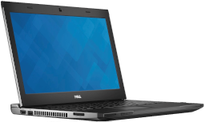

# Dell Latitude 3330 "Becky"

## Overview
macOS High Sierra on OpenCore [0.7.5](https://github.com/acidanthera/OpenCorePkg/releases/tag/0.7.5)

## Specifications
| Component | Name |
--- | --- |
CPU | Intel Core i3-2375M "Sandy Bridge" @ 1.5 GHz
RAM | 4GB PC3-10600 DDR3 RAM (2x 2GB sticks)
iGPU | Intel HD Graphics 3000
Chipset | Intel HM77 Express "Panther Point-M"
HDD | 160GB Seagate ST9170412AS SATA HDD
NIC | Built-in Intel 82579LM gigabit ethernet
WiFi-BT | Atheros AR5B195
Audio | Built-in IDT 92HD93BXX HD audio
Display | Built-in 13" 1366x768 LCD

## BIOS configuration
Dell A10 BIOS

## OpenCore configuration

### ACPI
|SSDT|Notes|
--- | ---
[SSDT-HPET](Files/SSDT-HPET.dsl) | HPET IRQ assignments, created with CorpNewt's [SSDTTime](https://github.com/corpnewt/SSDTTime)
[SSDT-IMEI](https://github.com/acidanthera/OpenCorePkg/blob/master/Docs/AcpiSamples/Source/SSDT-IMEI.dsl) | Provides IMEI device for HD3000 compatibility on 7 series chipset
[SSDT-PNLF](Files/SSDT-PNLF.dsl) | Screen brightness support
[SSDT-PRW](Files/SSDT-PRW.dsl) | Prevents instant wakes from sleep; disables GFX0 device under macOS
[SSDT-XOSI](Files/SSDT-XOSI.dsl) | _OSI replacement identifing macOS as Windows 7

### DeviceProperties
* PciRoot(0x0)/Pci(0x2,0x0)
    * AAPL,snb-platform-id = `00000100` - SNB platform-id
* PciRoot(0x0)/Pci(0x16,0x0)
    * device-id = `3A1C0000` - IMEI device spoof
* PciRoot(0x0)/Pci(0x1C,0x1)/Pci(0x0,0x0)
    * name = `pci168c,2a` - WiFi card spoof
* PciRoot(0x0)/Pci(0x1C,0x5)/Pci(0x0,0x0)
    * name = `pci14e4,16bc` - SD card reader spoof

### Kexts
|Kext|Version|Notes|
|---|---|---|
AppleALC | [1.6.6](https://github.com/acidanthera/AppleALC/releases/tag/1.6.6) | Audio support
BrightnessKeys | [1.0.2](https://github.com/acidanthera/BrightnessKeys/releases/tag/1.0.2) | Handles F4 and F5 brightness keys
IntelMausi | [1.0.7](https://github.com/acidanthera/IntelMausi/releases/tag/1.0.7) | Ethernet support
IOath3kfrmwr | [1.2.1](https://github.com/RehabMan/OS-X-Atheros-3k-Firmware) | Bluetooth support
Lilu | [1.5.7](https://github.com/acidanthera/Lilu/releases/tag/1.5.7)
RestrictEvents | TBD | Enables Memory tab in System Information
SMCBatteryManager | [1.2.7](https://github.com/acidanthera/VirtualSMC/releases/tag/1.2.7) | Battery support
USBMap | [N/A](Files/USBMap.kext) | USB map created with CorpNewt's [USBMap](https://github.com/corpnewt/USBMap)
VirtualSMC | [1.2.7](https://github.com/acidanthera/VirtualSMC/releases/tag/1.2.7) | SMC emulator
VoodooPS2Controller-R6Bronxteck.kext | [N/A](Files/VoodooPS2Controller-R6Bronxteck.kext) | PS/2 support
WhateverGreen | [1.5.5](https://github.com/acidanthera/WhateverGreen/releases/tag/1.5.5) | Graphics support

### PlatformInfo
* Use MacBookAir4,2 for SystemProductName
