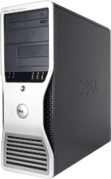

# Dell Precision 390 Workstation

## Overview
OS X El Capitan on OpenCore [0.9.4](https://github.com/acidanthera/OpenCorePkg/releases/tag/0.9.4)

## Specifications
| Component | Name |
--- | --- |
CPU | Intel Core 2 Duo E6400 "Conroe" @ 2.13 GHz
Chipset | Intel 975X "Glenwood"
RAM | 4GB PC2-5300E DDR2 ECC RAM (4x 1GB sticks)
GPU | ATI Radeon HD 5450
HDD | 160GB Seagate ST3160815AS SATA HDD
DVD | HLDS GSA-H21N DVD±RW PATA Optical Drive
DVD | HLDS GDR-8164B DVD-ROM PATA Optical Drive
NIC | Built-in Broadcom BCM5754 Gigabit Ethernet
Audio | Built-in SigmaTel STAC9200 HD Audio

## Quirks/issues
* Ethernet link light will not be lit up with default version of BCM5722D kext, either rebuild without [this](https://github.com/chris1111/BCM5722D/blob/master/Private.cpp#L440) line or patch out:
  * Find: E8 D6 F5 FF FF BE 50 04 00 00
  * Replace: 90 90 90 90 90 BE 50 04 00 00

## BIOS configuration
Dell 2.6.0 BIOS
* Drives
  * Diskette Drive = USB
  * SMART = On
* Performance
  * SpeedStep = On
  * Virtualization = On

## DUET
Machine is Intel-based legacy system, use standard OpenDuet version.

## OpenCore configuration

### ACPI
|SSDT|Notes|
--- | ---
[SSDT-DEV](Files/SSDT-DEV.dsl) | Add missing ACPI devices for GPU and EHCI controller
[SSDT-HPET](Files/SSDT-HPET.dsl) | HPET _CRS replacement (generated with [SSDTTime](https://github.com/corpnewt/SSDTTime))
[SSDT-XOSI](Files/SSDT-XOSI.dsl) | _OSI replacement identifing macOS as Windows XP (generated with [SSDTTime](https://github.com/corpnewt/SSDTTime))

### DeviceProperties
* PciRoot(0x4)/Pci(0x1,0x0)/Pci(0x0,0x0)
    * Various properties to support ATI Radeon HD 5450, refer to sample config.plist

### Kexts
|Kext|Version|Notes|
|---|---|---|
[AHCIPortInjector](Files/AHCIPortInjector.kext) | N/A | AHCI port injector (cosmetic)
AppleALC | [1.8.4](https://github.com/acidanthera/AppleALC/releases/tag/1.8.4) | Audio support
BCM5722D.kext | [2.3.7](https://github.com/chris1111/BCM5722D/releases/tag/V-2.3.7) | Ethernet support
Lilu | [1.6.6](https://github.com/acidanthera/Lilu/releases/tag/1.6.6) | Kext patching support
[USBMap](Files/USBMap.kext) | N/A | [USBToolbox](https://github.com/USBToolBox/tool)-generated USB map kext
VirtualSMC | [1.3.2](https://github.com/acidanthera/VirtualSMC/releases/tag/1.3.2) | SMC emulator

### PlatformInfo
* Use MacPro3,1 for SystemProductName
