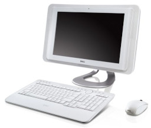

# Dell Studio One 19 1909

## Overview
macOS Sierra on OpenCore [0.9.4](https://github.com/acidanthera/OpenCorePkg/releases/tag/0.9.4)

## Specifications
| Component | Name |
--- | --- |
CPU | Intel Core 2 Quad Q8200 "Yorkfield" @ 2.33 GHz
Chipset | NVIDIA nForce MCP7A
RAM | 4GB PC2-6400 DDR2 RAM (2x 2GB sticks)
iGPU | NVIDIA GeForce 9300
HDD | 500GB WD Blue SATA HDD
DVD | TSST TS-T633A SATA DVD Burner
NIC | Built-in Broadcom BCM5906M Fast Ethernet
WiFi | Dell Wireless 1510 mPCIe Wireless-N Card
Audio | Built-in Realtek ALC262 HD Audio
Display | Built-in 19" 1366x768 Touchscreen LCD

## Quirks/issues
* Internal display is blank on first boot, must sleep/wake machine at least once for internal display to be functional.
    * Installation will require nv_disable=1 to be specified.
* Touchscreen is nonfunctional (no NextWindow support on macOS).
* DVD drive is not always detected and may need a sleep/wake cycle to appear.
* Very low levels of brightness causes display flicker.

## BIOS configuration
Dell A10 BIOS with default settings

## DUET
Machine is nForce-based legacy system, use OpenDuet alternative BlockIO version.

## OpenCore configuration

### ACPI
|SSDT|Notes|
--- | ---
[SSDT-PNLF](Files/SSDT-PNLF.dsl) | Screen brightness support
[SSDT-XOSI](Files/SSDT-XOSI.dsl) | _OSI replacement identifing macOS as Windows Vista

### DeviceProperties
* PciRoot(0x0)/Pci(0x10,0x0)/Pci(0x0,0x0)
    * Various properties to support NVIDIA GeForce graphics and internal display, refer to sample config.plist

### Kexts
|Kext|Version|Notes|
|---|---|---|
AppleALC | [1.8.4](https://github.com/acidanthera/AppleALC/releases/tag/1.8.4) | Audio support
BCM5722D.kext | [2.3.7](https://github.com/chris1111/BCM5722D/releases/tag/V-2.3.7) | Ethernet support
Lilu | [1.6.6](https://github.com/acidanthera/Lilu/releases/tag/1.6.6) | Kext patching support
VirtualSMC | [1.3.2](https://github.com/acidanthera/VirtualSMC/releases/tag/1.3.2) | SMC emulator
WhateverGreen | [1.6.5](https://github.com/acidanthera/WhateverGreen/releases/tag/1.6.5) | Graphics support

### PlatformInfo
* Use iMac10,1 for SystemProductName
