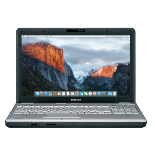

# Toshiba Satellite L505-ES5034

## Overview
OS X El Capitan on OpenCore [1.0.3](https://github.com/acidanthera/OpenCorePkg/releases/tag/1.0.3)  
[Service manual](Docs/satellite_L505-ES5034.pdf)

## Specifications
| Component | Name |
--- | --- |
CPU | Intel Core i3-330M "Arrandale" @ 2.13 GHz
Chipset | Intel HM55 "Ibex Peak"
RAM | 4GB PC3-10600 DDR3 RAM (2x 2GB sticks)
iGPU | Intel HD Graphics
HDD | 250GB Toshiba MK2555GSXF SATA HDD
DVD | TEAC DV-W28S-VT DVD-RW SATA optical drive
NIC | Built-in Realtek RTL8136 10/100 ethernet
WiFi | Atheros AR5B95 mPCIe card
Audio | Built-in Realtek ALC272 HD audio
Display | Built-in 15.6" 1336x768 LCD

## Functionality
* VGA port does not work
* Internal display is sometimes blank at startup
* System sometimes will hang at the Toshiba logo after a reboot
* Trackpad stops working after resume from sleep

## BIOS configuration
* BIOS version 1.40 with default settings
* Use standard 64-bit DUET

## OpenCore configuration

[Sample config.plist](Files/config-sample.plist)

### ACPI
|SSDT|Notes|
--- | ---
[SSDT-EC](Files/SSDT-EC.dsl) | Faked Embedded Controller
[SSDT-HPET](Files/SSDT-HPET.dsl) | HPET _CRS (Needs _CRS to XCRS Rename)
[SSDT-PNLF](Files/SSDT-PNLF.dsl) | Defines PNLF device with a _UID of 14 for backlight control
[SSDT-PRW](Files/SSDT-PRW.dsl) | USB _PRW replacements (requires _PRW to XPRW renames)

### DeviceProperties
* PciRoot(0x0)/Pci(0x1C,0x1)/Pci(0x0,0x0)
    * device-id = `2A000000` - Atheros40 card spoof
    * name = `pci168c,2a` - Atheros40 card spoof
* PciRoot(0x0)/Pci(0x2,0x0)
    * framebuffer-fbccontrol-allzero - `01000000` - prevents freeze on wake
    * framebuffer-featurecontrol-allzero - `01000000` - prevents freeze on wake
    * framebuffer-patch-enable - `01000000` - enables WEG patching
    * framebuffer-singlelink - `01000000` - use single link for display

### Kexts
|Kext|Version|Notes|
|---|---|---|
AppleALC | [1.9.3](https://github.com/acidanthera/AppleALC/releases/tag/1.9.3) | Audio support
IntelBacklight | [1.0.12](https://bitbucket.org/RehabMan/os-x-intel-backlight/downloads/RehabMan-IntelBacklight-2017-0226.zip) | Screen brightness support
Lilu | [1.7.0](https://github.com/acidanthera/Lilu/releases/tag/1.7.0) | Kext patching support
RealtekRTL8100 | [1.0.0](https://www.insanelymac.com/forum/files/file/259-realtekrtl8100-binary/?changelog=1529) | Ethernet support
SMCBatteryManager | [1.1.4](https://github.com/acidanthera/VirtualSMC/releases/tag/1.1.4) | Battery support (regression in current versions)
USBMap | [N/A](Files/USBMap.kext) | USB map created with CorpNewt's [USBMap](https://github.com/corpnewt/USBMap)
VoodooPS2 | [2.3.7](https://github.com/acidanthera/VoodooPS2/releases/tag/2.3.7) | Keyboard/trackpad
VirtualSMC | [1.3.4](https://github.com/acidanthera/VirtualSMC/releases/tag/1.3.4) | SMC emulator
WhateverGreen | [1.6.9](https://github.com/acidanthera/WhateverGreen/releases/tag/1.6.9) | Graphics support

### PlatformInfo
* Use MacBookPro6,2 for SystemProductName
